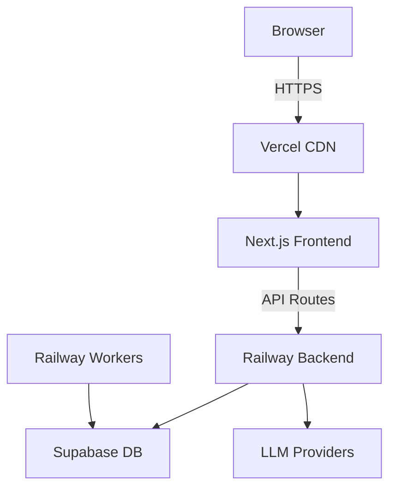

# CF0 Architecture Overview

This document provides a comprehensive overview of the CF0 system architecture, designed to guide Cursor AI agents and developers in understanding and extending the system.

## System Overview

CF0 is an intelligent spreadsheet assistant that combines traditional spreadsheet functionality with AI-powered analysis and automation. The system uses a monorepo structure with three main components:

```
cf0/
├── apps/
│   ├── frontend/        # Next.js 14 App Router UI
│   ├── api-gateway/     # FastAPI backend service
│   └── workers/         # Background job processors
├── libs/                # Shared libraries
└── docs/                # Documentation
```

## Deployment Architecture

### Infrastructure Stack
- **Frontend**: Vercel (Next.js hosting)
- **Backend**: Railway (FastAPI containers)
- **Database**: Supabase (PostgreSQL + Auth)
- **Background Jobs**: Railway Workers

### Service Communication


## Core Components

### 1. Frontend (apps/frontend)
- **Framework**: Next.js 14 with App Router
- **UI Library**: React 18 with TypeScript
- **Styling**: Tailwind CSS + shadcn/ui components
- **State Management**: React Context (WorkbookContext, ModelContext)
- **Real-time**: Server-Sent Events (SSE) for streaming

Key directories:
- `/app` - Next.js app router pages and API routes
- `/components` - Reusable UI components
- `/hooks` - Custom React hooks (streaming, localStorage)
- `/utils` - Helper functions and API clients
- `/context` - Global state providers

### 2. API Gateway (apps/api-gateway)
- **Framework**: FastAPI with Python 3.11
- **Streaming**: SSE via sse-starlette
- **Database**: Supabase client for PostgreSQL
- **LLM Integration**: Multi-provider support (OpenAI, Anthropic, Groq)

Key modules:
- `/agents` - AI agent implementations (ask, analyst)
- `/spreadsheet_engine` - Core spreadsheet logic
- `/streaming` - SSE event handling
- `/llm` - LLM provider abstraction layer
- `/api` - REST endpoints and schemas

### 3. Workers (apps/workers)
- **Purpose**: Background job processing
- **Framework**: Python with asyncio
- **Tasks**: Data persistence, long-running computations

## Key Architectural Patterns

### 1. Agent Pattern
The system uses specialized agents for different tasks:

```python
BaseAgent (Abstract)
├── AskAgent      # Read-only analysis
└── AnalystAgent  # Can modify spreadsheets
```

Agents use a tool-calling pattern where spreadsheet operations are exposed as callable functions.

### 2. LLM Abstraction
A provider-agnostic interface allows switching between LLM providers:

```python
LLMClient (Protocol)
├── OpenAIClient
├── AnthropicClient
└── GroqClient
```

### 3. Streaming Architecture
Real-time updates use Server-Sent Events:

```
Client → API Route → Backend Stream → SSE Events → UI Updates
```

Event types:
- `content` - Text chunks
- `tool_call` - Function invocations
- `tool_result` - Function results
- `update` - Spreadsheet cell updates
- `status` - Progress updates
- `done` - Stream completion

### 4. Spreadsheet Engine
Core spreadsheet functionality with:
- Cell references (A1 notation)
- Formula evaluation
- Cross-sheet references
- Dependency tracking
- Incremental recalculation

## Data Flow

### 1. Chat Request Flow
```
1. User enters message in chat interface
2. Frontend sends POST to /api/langserve/chat
3. API route proxies to backend /ask/stream or /analyst/stream
4. Backend initializes agent with tools
5. Agent processes message and calls tools
6. Results stream back via SSE
7. Frontend updates UI in real-time
```

### 2. Spreadsheet Update Flow
```
1. Agent calls set_cell or set_cells tool
2. Tool updates in-memory spreadsheet
3. Update event sent via SSE stream
4. Frontend receives update in pending state
5. User can apply or reject changes
6. Applied changes persist to database
```

## Database Schema

### Core Tables
- `workbooks` - Workbook metadata
- `sheets` - Individual sheet data
- `chat_history` - Conversation history
- `prompts` - System prompts for agents

### Authentication
Supabase Auth handles:
- User registration/login
- Session management
- Row-level security (RLS)

## Security Considerations

1. **Authentication**: All API calls require valid session
2. **Authorization**: RLS policies enforce data access
3. **Input Validation**: Pydantic models validate all inputs
4. **Rate Limiting**: Concurrency limits on LLM calls
5. **CORS**: Restricted to allowed origins

## Extension Points

### Adding New Agents
1. Create new agent class extending BaseAgent
2. Define tools and system prompt
3. Register in agent factory
4. Add streaming endpoint

### Adding New Tools
1. Implement tool function in spreadsheet_engine
2. Add to agent's tool registry
3. Document parameters and return types
4. Test with various inputs

### Adding LLM Providers
1. Implement LLMClient protocol
2. Add to provider registry
3. Handle provider-specific features
4. Test streaming compatibility

## Performance Optimizations

1. **Streaming**: Chunked responses for better UX
2. **Caching**: In-memory workbook cache
3. **Batching**: Cell updates batched in frontend
4. **Lazy Loading**: Sheets loaded on demand
5. **Connection Pooling**: Reused database connections

## Monitoring and Debugging

1. **Logging**: Structured logs with request IDs
2. **Error Tracking**: Sentry integration (when configured)
3. **Debug Mode**: Verbose SSE event logging
4. **Health Checks**: /health endpoint monitoring

## Best Practices

1. **Type Safety**: Use TypeScript/Pydantic throughout
2. **Error Handling**: Graceful degradation
3. **Testing**: Unit tests for critical paths
4. **Documentation**: Inline comments for complex logic
5. **Versioning**: Semantic versioning for APIs 