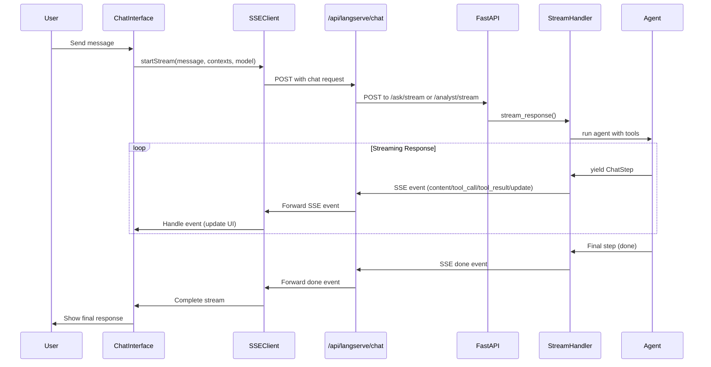

# Streaming Implementation Guide

This guide documents the unified SSE (Server-Sent Events) streaming architecture used in CF0 for real-time communication between the frontend and backend.

## Overview

CF0 uses SSE for streaming AI responses and spreadsheet updates from the backend to the frontend. This enables:
- Real-time text generation display
- Live spreadsheet updates
- Progress indicators for tool usage
- Error handling without breaking the stream

## Architecture

### Flow Diagram


## Event Types

### Backend Event Types (EventType enum)
```python
class EventType(Enum):
    REASONING = "reasoning"      # AI thinking process
    TOOL_CALL = "tool_call"      # Function invocation
    TOOL_RESULT = "tool_result"  # Function result
    CONTENT = "content"          # Text content chunks
    ERROR = "error"              # Error events
    STATUS = "status"            # Status updates
    DONE = "done"                # Stream completion
    HEARTBEAT = "heartbeat"      # Keep-alive events
    UPDATE = "update"            # Workbook cell updates
```

### Event Payload Structures

#### Content Event
```typescript
{
  event: "content",
  data: {
    delta: string,           // Text chunk
    finish_reason?: string   // Optional completion reason
  }
}
```

#### Tool Call Event
```typescript
{
  event: "tool_call",
  data: {
    tool: string,           // Tool name
    arguments: any,         // Tool arguments
    id: string             // Unique call ID
  }
}
```

#### Tool Result Event
```typescript
{
  event: "tool_result",
  data: {
    tool_id: string,       // Matching call ID
    result: any            // Tool execution result
  }
}
```

#### Update Event (Workbook)
```typescript
{
  event: "update",
  data: {
    updates: Array<{
      cell: string,        // Cell reference (e.g., "A1")
      old_value: any,      // Previous value
      new_value: any,      // New value
      kind: string         // Update type
    }>,
    sheet_id?: string,     // Target sheet
    workbook_id?: string   // Target workbook
  }
}
```

## Backend Implementation

### 1. SSE Handler (streaming/sse_handler.py)
```python
class StreamingHandler:
    async def stream_response(self, request: Request, chat_request: ChatRequest):
        return EventSourceResponse(
            self._event_generator(chat_request),
            headers={
                "Cache-Control": "no-cache",
                "X-Accel-Buffering": "no",  # Disable Nginx buffering
            }
        )
```

### 2. Event Conversion
The handler converts various chunk formats to SSE events:
```python
def _convert_legacy_chunk(self, chunk: Dict[str, Any]) -> Optional[StreamEvent]:
    # Handle update chunks for workbook modifications
    if chunk.get('type') == 'update':
        return StreamEvent(
            type=EventType.UPDATE,
            data={
                "updates": chunk.get('payload', []),
                "sheet_id": chunk.get('sheet_id'),
                "workbook_id": chunk.get('workbook_id')
            }
        )
```

### 3. Streaming Endpoints
```python
@app.post("/ask/stream")     # Read-only analysis
@app.post("/analyst/stream")  # Can modify spreadsheets
```

## Frontend Implementation

### 1. SSE Client (utils/sse-client.ts)
```typescript
export class SSEClient {
  async streamChat(request: ChatRequest, handlers: StreamHandlers) {
    this.eventSource = new EventSourcePolyfill(url, {
      method: 'POST',
      headers: { 'Content-Type': 'application/json' },
      body: JSON.stringify(request),
      withCredentials: true,
    });
    
    this.setupEventHandlers(handlers);
  }
}
```

### 2. React Hook (hooks/useChatStreamSSE.ts)
```typescript
export function useChatStreamSSE(
  setMessages: React.Dispatch<React.SetStateAction<MessageType[]>>,
  mode: 'ask' | 'analyst'
): UseChatStreamReturn {
  // Manages streaming state and pending updates
  const [pendingUpdates, setPendingUpdates] = useState<PendingUpdate[]>([]);
  
  // Handles update events
  onUpdate: (data) => {
    if (data.updates && Array.isArray(data.updates)) {
      setPendingUpdates(prev => [...prev, ...data.updates]);
    }
  }
}
```

### 3. Pending Updates UI
```typescript
<PendingBar 
  visible={pendingUpdates.length > 0}
  pendingCount={pendingUpdates.length}
  onApply={applyPendingUpdates}
  onReject={rejectPendingUpdates}
/>
```

## Best Practices

### 1. Error Handling
- Always handle connection errors gracefully
- Implement retry logic for transient failures
- Show clear error messages to users

### 2. Performance
- Batch content updates (50ms intervals)
- Use request IDs to prevent race conditions
- Clean up event listeners on unmount

### 3. Buffering Prevention
- Set `X-Accel-Buffering: no` header
- Disable proxy buffering in production
- Use small chunk delays (0.001s) to prevent overwhelming

### 4. State Management
- Track streaming state explicitly
- Clear pending updates on new streams
- Handle partial content gracefully

## Common Issues and Solutions

### Issue: No UI Updates Despite Network Activity
**Cause**: Update events not being converted/handled properly
**Solution**: 
1. Ensure backend converts update chunks to UPDATE events
2. Add update event listener in frontend SSE client
3. Process updates in the React hook

### Issue: Streaming Appears Stuck
**Cause**: Buffering at proxy/CDN level
**Solution**:
1. Add anti-buffering headers
2. Ensure EventSource polyfill is used
3. Check proxy configuration

### Issue: Lost Events
**Cause**: Race conditions or missed event registration
**Solution**:
1. Use stream IDs to track current stream
2. Register all event handlers before starting
3. Handle events defensively

## Testing Streaming

### Backend Testing
```python
# Enable debug logging
DEBUG_STREAMING=1 python main.py

# Check event generation
print(f"[SSE] Chunk #{chunk_count}: Type={type(chunk).__name__}")
```

### Frontend Testing
```typescript
// Add console logs to event handlers
onContent: (data) => {
  console.log('Content event:', data);
}
```

### Network Testing
1. Open browser DevTools Network tab
2. Look for EventStream type requests
3. Check Response tab for SSE events
4. Verify event format and timing

## Adding New Event Types

1. **Backend**: Add to EventType enum
2. **Backend**: Handle in _convert_legacy_chunk
3. **Frontend**: Add to StreamEvent type
4. **Frontend**: Add handler in SSEClient
5. **Frontend**: Process in React hook
6. **Test**: Verify end-to-end flow 